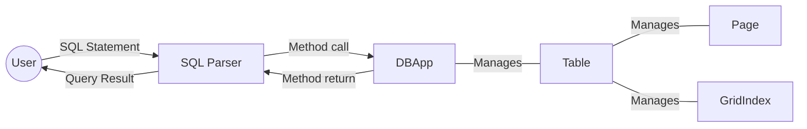

# Welcome to our Mini Database Engine!

This project is an application of the **Advanced Database** course where we are concerned with database optimization and file organization on disk. It is a simplified version of a DBMS (Database Management System) where only the following operations are supported:-
1. Creating table.
2. Inserting a tuple.
3. Deleting tuples.
4. Searching in table.
5. Creating a grid index.
6. Dropping a table or an index.

## Bonus Features :)
We implemented 3 bonus features that were not required in the project description.
1. **SQL parser** support which enables the user to execute written SQL statements instead of using the API. 
2. Supporting **Operator precedence** in the select statement (AND -> OR -> XOR).
3. Supporting **Partial queries** on the Grid index. 

## How to work with our Engine?

There are two ways you can interact with it:-
1. You can use the API provided by the **DBAppInterface.java** where you can find a method for each of the operations mentioned.
2. Or you can interact with our smart **SQL Interpreter** through writing SQL statements right into the console. Just run the main method in the **MainParser.java**  class and start writing!

## Supported syntax

#### To create a new table:
 ```sql
create table TABLE_NAME(
COLUMN1_NAME COLUMN1_DATA_TYPE 
CHECK(COLUMN1_NAME BETWEEN COLUMN1_MIN and COLUMN1_MAX),
COLUMN2_NAME COLUMN2_DATA_TYPE 
CHECK(COLUMN2_NAME BETWEEN COLUMN2_MIN and COLUMN2_MAX),
 ..., 
 primary key(CLUSTERING_KEY_NAME))
```
>**Note**: It's obligatory to specify the Min and Max values for each column. 
>The primary key can only be **one column**.
#### To remove a table:
 ```sql
drop table TABLE_NAME
```
#### To create a new Grid Index on a table:
 ```sql
create index INDEX_NAME on TABLE_NAME(COLUMN_NAME_1,...)
```
#### To remove an index from a table:
 ```sql
drop index INDEX_ID on table TABLE_NAME
```
#### To insert a record:
 ```sql
insert into TABLE_NAME values(COLUMN_1_VALUE, COLUMN_2_VALUE,...)
```
>**Note**: 
>It's obligatory to insert values for all columns and the order should be according to the order displayed to the console during the table creation. 
> Date acceptable format is "YYYY-MM-DD"

#### To update a record:
 ```sql
update TABLE_NAME set COLUMN_1 = VALUE_1, COLUMN_2 = VALUE_2,... 
where CLUSTERING_KEY_NAME = CLUSTERING_KEY_VALUE
```
>**Note**: 
>The update can only happen to the one tuple specified by the CLUSTERING_KEY_VALUE.
>Update using a condition on other columns is not supported.

#### To delete records:
 ```sql
delete from TABLE_NAME where CONDITION_1 and CONDITION_2 ....
```
>**Note**: The conditions in the delete statement must be **AND**ed together and must have = as their operators.

#### To select records:
 ```sql
select * from TABLE_NAME where CONDITION_1 OPERATOR_1 CONDITION_2 ....
```
>**Note**: 
>The conditions in the select statement could have **>=**, **>** , **<=** , **<** , **=** ,  or **!=**
>The operators in the select statement could be AND, OR, or XOR
> The AND has the highest precedence, then comes the OR, then XOR

#### To see the contents of a table:
 ```sql
show table TABLE_NAME
```

#### To terminate the Parser program type ``exit``
**General Notes**:
- Each SQL statement must be passed to the console in one line (The parser can support multiple-line SQL commands but not through the console).
- The parser does not support commenting or nested queries.
- The parser is not case sensitive.


## Supported Data Types

We support only four data types:-

Java | SQL
:------------: | :------------:
java.lang.Integer | int
java.lang.String | varchar
java.lang.Double | double
java.util.Date | date

>Date acceptable format is "YYYY-MM-DD"


## Simplified Flow Chart

## Project Contributors
* [Omar Khair](https://github.com/omarkhair)
* [Mohamed Eshiba](https://github.com/mohamedeshiba)
* [Hesham Moneer](https://github.com/HeshamMoneer)

